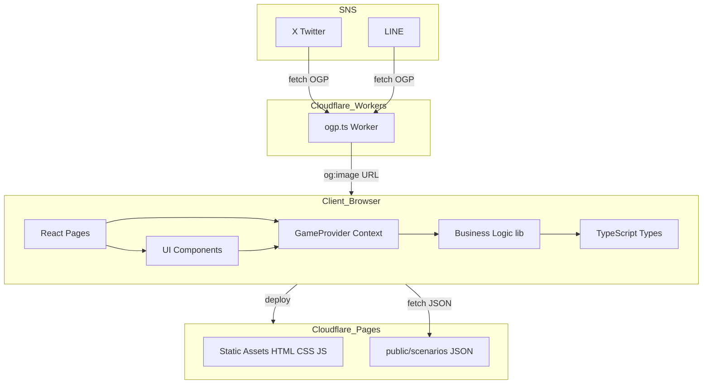
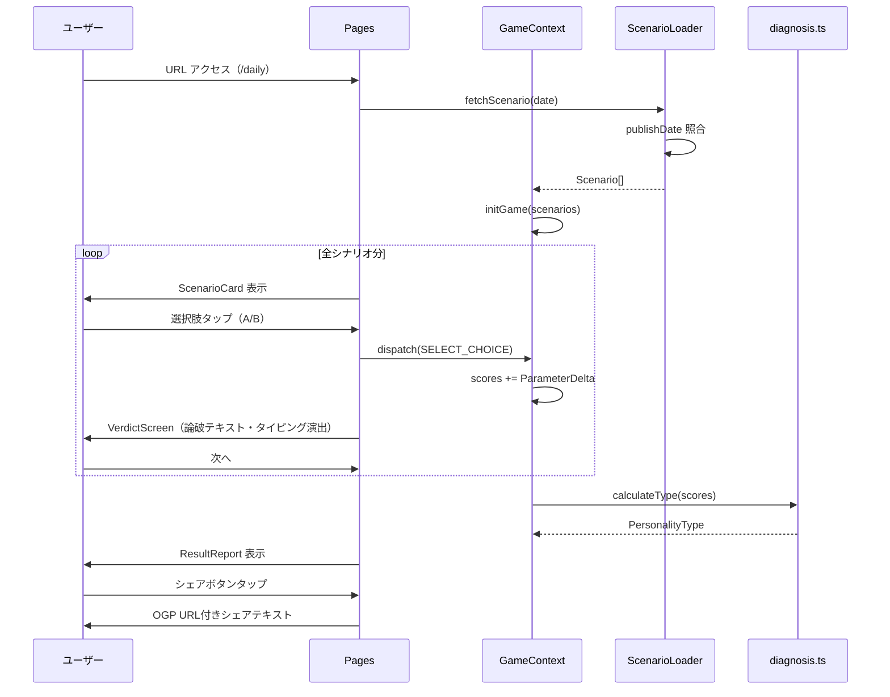
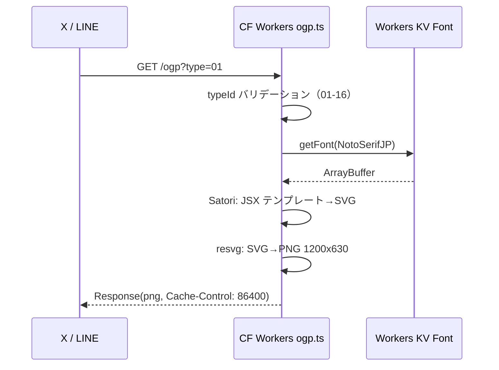

# 技術設計書: AIモラル診断ゲーム

## Overview

AIモラル診断ゲームは、倫理的ジレンマシナリオを通じてユーザーの道徳的傾向を6軸スコアで分析し、16タイプのいずれかとして診断結果を提示するインタラクティブWebゲームです。本番環境でのAI API呼び出しを持たない完全静的・クライアントサイド完結型アーキテクチャを採用し、月額¥500以内の極限コスト制約下でグローバルエッジ配信を実現します。

**Users**: SNS上での自己表現・話題の起点を求めるプレイヤーが、URLタップ即プレイの体験で診断を受け、辛口タイプ名をSNSにシェアする。

**Impact**: 完全グリーンフィールド実装。Cloudflare Pages（静的配信）+ Cloudflare Workers（OGP生成）の2レイヤー構成を新規構築する。

### Goals

- 5〜10問の倫理的ジレンマを通じた6軸スコア診断・16タイプ判定をクライアントサイドで完結する
- デイリーモード（全ユーザー共通の1問）をSNS拡散の核として初日リリースに含める
- Cloudflare Workers + `workers-og` でタイプ別OGP画像をエッジ生成し、X/LINEシェアのリッチプレビューを実現する
- バンドルサイズ150KB以内・LCP 2秒以内（3G回線）を達成する

### Non-Goals

- シリーズモード（テーマ別パック）・ランダムモード・友達比較機能（Phase 2）
- リアルタイムAI生成によるシナリオ・論破テキスト（事前生成静的JSONで代替）
- ユーザー認証・データベース・スコアランキングサーバー
- SVGキャラクターイラスト（Phase 1はプレースホルダー）

---

## Architecture

### Architecture Pattern & Boundary Map

アーキテクチャは **Feature-Sliced Design（変形）** を採用し、UIレイヤー・ビジネスロジックレイヤー・データレイヤーの依存方向を一方向に固定する。Cloudflare Pagesが静的アセットを配信し、OGP生成のみCloudflare Workersが担当する分離設計とする。



**Architecture Integration**:
- 選択パターン: Layered Architecture（UI → Context → Business Logic → Data）
- ドメイン境界: ゲーム進行（GameContext）・診断ロジック（lib/diagnosis）・データ配信（public/scenarios）・OGP（workers）の4境界
- 新規コンポーネントの根拠: 全て新規作成。GDDのディレクトリ構成（`docs/gdd/15-tech-stack.md`）に準拠

### Technology Stack

| Layer | Choice / Version | Role in Feature | Notes |
|-------|------------------|-----------------|-------|
| Frontend | React 19 + TypeScript strict | UIコンポーネント・状態管理 | ShadcnUI互換性のためPreactより優先 |
| Build | Vite 6 | バンドル・最適化・Cloudflare Pages配信 | Tree-shaking・コード分割 |
| Styling | Tailwind CSS v4 + ShadcnUI | UIデザインシステム | ユーティリティクラス + 設計済みコンポーネント |
| State | React Context + useReducer | ゲーム進行状態の一元管理 | DBレス・localStorageと同期 |
| Storage | localStorage | セッション保持・デイリープレイ済み管理 | サーバー不要 |
| Data | 静的JSON (public/scenarios/) | シナリオ・論破テキスト・スコア重み | 事前生成型 |
| Edge Runtime | Cloudflare Workers | OGP画像動的生成のみ | Satori + resvg-wasm パイプライン |
| OGP Library | workers-og | JSX→SVG→PNG変換のエッジ実装 | WASMの初期化複雑性を隠蔽 |
| Hosting | Cloudflare Pages | グローバルCDN静的配信 | 月額¥0〜 |
| IaC | wrangler.toml | Workers設定・デプロイ管理 | Cloudflare公式CLI |

詳細な選定根拠・比較は `research.md` の Design Decisions セクションを参照。

---

## System Flows

### 1. コアゲームフロー（診断シーケンス）



### 2. OGP生成フロー（Workers）



---

## Requirements Traceability

| 要件 | 概要 | 主要コンポーネント | インターフェース | フロー |
|------|------|------------------|----------------|--------|
| 1.1 | URLアクセス即プレイ | Pages/daily.tsx | ScenarioLoader | ゲームフロー |
| 1.2 | 5〜10問提示 | GameContext | GameState | ゲームフロー |
| 1.3 | 選択→次へ遷移 | ChoiceButton, GameContext | dispatch(SELECT_CHOICE) | ゲームフロー |
| 1.4 | 2択選択肢 | ScenarioCard | ScenarioCardProps | — |
| 1.5 | 進捗表示 | ProgressBar | GameStateReader | — |
| 1.6 | セッション保持 | SessionManager | SessionStorage | — |
| 1.7 | モバイルファースト | 全UIコンポーネント | BaseUIPanelProps | — |
| 2.1〜2.6 | 論破システム | VerdictScreen | VerdictProps | — |
| 3.1〜3.6 | 6軸スコアリング・16タイプ判定 | scoring.ts, diagnosis.ts | DiagnosisService | — |
| 4.1〜4.6 | 結果レポート | ResultReport, RadarChart | ResultReportProps | — |
| 5.1〜5.6 | SNSシェア・OGP | ShareButtons, ogp.ts | OGPWorker | OGPフロー |
| 6.1〜6.6 | 静的コンテンツ管理 | ScenarioLoader, ScenarioSchema | ScenarioLoaderService | — |
| 7.1〜7.5 | パフォーマンス | Cloudflare Pages設定, Vite設定 | — | — |

---

## Components and Interfaces

### コンポーネント一覧

| Component | Domain/Layer | Intent | Req Coverage | Key Dependencies | Contracts |
|-----------|--------------|--------|--------------|------------------|-----------|
| GameContext / GameProvider | State | ゲーム全状態の一元管理 | 1.2, 1.3, 1.6, 3.1 | scoring.ts, diagnosis.ts (P0) | State |
| ScenarioLoader | Data | シナリオJSON取得・バリデーション | 6.1, 6.2, 6.6 | public/scenarios/ (P0) | Service |
| scoring.ts | Business Logic | 選択ごとの6軸スコア加算 | 3.1, 3.2, 3.4 | — | Service |
| diagnosis.ts | Business Logic | 6軸スコア → 4二元軸 → 16タイプ判定 | 3.2, 3.3, 3.5, 3.6 | TYPE_MAP (P0) | Service |
| SessionManager | Infrastructure | localStorage 同期・デイリー管理 | 1.6, デイリーモード | localStorage (P0) | Service |
| share.ts | Business Logic | シェアテキスト・URL生成 | 5.2, 5.5 | PersonalityType (P0) | Service |
| ScenarioCard | UI | シナリオ本文・タグ・イラスト表示 | 1.4, 1.7 | GameContext (P0) | — |
| ChoiceButton | UI | A/B 二択・スワイプ対応タップUI | 1.3, 1.4, 1.7 | GameContext (P0) | — |
| VerdictScreen | UI | 論破テキスト・タイピング演出 | 2.1〜2.6 | GameContext (P1) | — |
| ResultReport | UI | タイプ名・コメント・付加情報表示 | 4.1〜4.5 | GameContext (P0), RadarChart (P0) | — |
| RadarChart | UI | 6軸スコアのSVGレーダーチャート | 4.2 | DiagnosisParams (P0) | — |
| ShareButtons | UI | X/LINE/URLコピーボタン | 5.1, 5.3, 5.5 | share.ts (P0) | — |
| ProgressBar | UI | 進捗（現在問 / 全問）表示 | 1.5 | GameContext (P1) | — |
| ogp.ts (Worker) | Edge Function | OGP画像（PNG 1200×630）生成 | 5.3, 5.4, 5.6 | workers-og (P0), KV Font (P1) | API |

---

### Business Logic Layer

#### scoring.ts

| Field | Detail |
|-------|--------|
| Intent | 各シナリオの選択に対して ParameterDelta を現在の DiagnosisParams に加算する |
| Requirements | 3.1, 3.2, 3.4 |

**Responsibilities & Constraints**
- `DiagnosisParams` の各軸値を加算・保持する。オーバーフローの上限なし（最終スコアで相対比較のため）
- 副作用なし。純粋関数として実装する

**Dependencies**
- Inbound: GameContext — 選択イベント時にスコア更新 (P0)
- Outbound: なし（純粋関数）

**Contracts**: Service [x]

##### Service Interface

```typescript
interface DiagnosisParams {
  result_efficiency: number;
  rule_discipline: number;
  humanity_morality: number;
  self_preservation: number;
  empathy_kindness: number;
  logic_coldness: number;
}

interface ScoringService {
  /** 初期スコアを返す（全軸0） */
  initParams(): DiagnosisParams;
  /** 現在スコアに選択の重みを加算した新スコアを返す */
  applyDelta(current: DiagnosisParams, delta: ParameterDelta): DiagnosisParams;
}
```

- Preconditions: `delta` の各フィールドは有限数値である
- Postconditions: 返値は入力の `current` に `delta` を加算した新オブジェクト（不変）
- Invariants: 関数は副作用を持たない

---

#### diagnosis.ts

| Field | Detail |
|-------|--------|
| Intent | 最終的な DiagnosisParams から4二元軸を導出し、対応する PersonalityType を返す |
| Requirements | 3.2, 3.3, 3.5, 3.6 |

**Responsibilities & Constraints**
- `TYPE_MAP`（16タイプの静的定数）を唯一の外部データとして参照する
- 同点タイブレークルールを内部に持つ

**Dependencies**
- Inbound: GameContext — 全シナリオ完了時に呼び出し (P0)
- Outbound: TYPE_MAP 定数 (P0)

**Contracts**: Service [x]

##### Service Interface

```typescript
type TypeAxis = 'U' | 'E'; // 功利 vs 共感
type OrderAxis = 'O' | 'F'; // 秩序 vs 自由
type ActionAxis = 'A' | 'P'; // 能動 vs 受動
type ScopeAxis = 'I' | 'C'; // 個人 vs 集団

type TypeCode = `${TypeAxis}${OrderAxis}${ActionAxis}${ScopeAxis}`; // e.g. "UEOA"

interface PersonalityType {
  code: TypeCode;
  id: number;          // 01〜16
  name: string;        // 例: "冷酷な設計者"
  catchphrase: string;
  description: string; // 200〜400字
  rival: number;       // 最も対立するタイプのid
}

interface DiagnosisService {
  /** DiagnosisParams から TypeCode を導出する */
  deriveTypeCode(params: DiagnosisParams): TypeCode;
  /** TypeCode から PersonalityType を返す */
  calculateType(params: DiagnosisParams): PersonalityType;
}
```

- Preconditions: `params` は `applyDelta` を経た有効な DiagnosisParams である
- Postconditions: 返値は必ず16タイプのいずれか1つ
- Invariants: 同一入力に対して常に同一出力（決定論的）

**TypeCode 導出ルール**:

```
U/E: result_efficiency > empathy_kindness → U, それ以外 → E
O/F: rule_discipline > self_preservation → O, それ以外 → F
A/P: (result_efficiency + rule_discipline + logic_coldness)
     > (humanity_morality + self_preservation + empathy_kindness) → A, それ以外 → P
I/C: humanity_morality > logic_coldness → C, それ以外 → I
```

**A/P軸の設計根拠**: 「能動」を決断力のある特性（結果追求・規律遵守・冷静な論理）の総和、「受動」を判断を委ねる特性（人情・自己保身・共感）の総和で比較する。固定閾値不要で、全シナリオのスコア規模に依存しない相対比較設計。

同点の場合は事前定義された優先ルール（U > E, O > F, A > P, I > C）を適用する。

---

#### ScenarioLoader

| Field | Detail |
|-------|--------|
| Intent | `public/scenarios/` から日付・モードに対応するシナリオJSONを取得し、型安全に返す |
| Requirements | 6.1, 6.2, 6.4, 6.6 |

**Responsibilities & Constraints**
- シナリオJSONのフェッチとスキーマバリデーション（実行時チェック）を担う
- エラー時はフォールバックエラー状態を返す。クラッシュしない

**Dependencies**
- Inbound: Pages/daily.tsx, Pages/series.tsx — 初期化時に呼び出し (P0)
- Outbound: `public/scenarios/*.json` — fetch (P0)

**Contracts**: Service [x]

##### Service Interface

```typescript
/** 独自定義の Result 型（外部ライブラリ不使用） */
type Result<T, E> =
  | { ok: true; value: T }
  | { ok: false; error: E };

type ScenarioLoadError =
  | { type: 'NOT_FOUND'; message: string }
  | { type: 'INVALID_SCHEMA'; message: string }
  | { type: 'NETWORK_ERROR'; message: string };

interface ScenarioLoaderService {
  /** デイリーシナリオを取得（publishDate で今日の日付と照合） */
  loadDaily(date: string): Promise<Result<Scenario, ScenarioLoadError>>;
  /** シリーズIDのシナリオリストを取得 */
  loadSeries(seriesId: string): Promise<Result<Scenario[], ScenarioLoadError>>;
}
```

---

#### SessionManager

| Field | Detail |
|-------|--------|
| Intent | ゲーム進行状態のlocalStorage永続化とデイリープレイ済み判定を担う |
| Requirements | 1.6, デイリーモード |

**Responsibilities & Constraints**
- `localStorage` への読み書きを唯一担う（他コンポーネントは直接localStorageにアクセスしない）
- ストレージ満杯・プライベートモード等の例外をキャッチし、in-memoryフォールバックで動作継続

**Contracts**: Service [x]

##### Service Interface

```typescript
interface GameSession {
  scenarioIds: string[];
  currentIndex: number;
  scores: DiagnosisParams;
  selectedChoices: Record<string, 'A' | 'B'>;
  completedAt: string | null;
}

interface SessionManagerService {
  saveSession(session: GameSession): void;
  loadSession(): GameSession | null;
  clearSession(): void;
  /** 今日のデイリーをプレイ済みか確認 */
  isDailyCompleted(date: string): boolean;
  markDailyCompleted(date: string, typeCode: TypeCode): void;
}
```

---

### State Layer

#### GameContext / GameProvider

| Field | Detail |
|-------|--------|
| Intent | ゲーム全体の進行状態（シナリオ・スコア・フェーズ）を一元管理し、全UIコンポーネントに提供する |
| Requirements | 1.2, 1.3, 1.6, 3.1 |

**Responsibilities & Constraints**
- `useReducer` によるアクション駆動の状態遷移
- sessionManager との同期は副作用（useEffect）で管理する

**Dependencies**
- Outbound: scoring.ts (P0), SessionManager (P0), diagnosis.ts (P0)

**Contracts**: State [x]

##### State Management

```typescript
type GamePhase =
  | 'LOADING'
  | 'SCENARIO'     // シナリオ表示中
  | 'CHOICE'       // 二択選択中
  | 'VERDICT'      // 論破テキスト表示中
  | 'RESULT'       // 診断結果表示
  | 'ERROR';

interface GameState {
  phase: GamePhase;
  scenarios: Scenario[];
  currentIndex: number;
  scores: DiagnosisParams;
  selectedChoices: Record<string, 'A' | 'B'>;
  result: PersonalityType | null;
  error: ScenarioLoadError | null;
}

type GameAction =
  | { type: 'INIT_GAME'; scenarios: Scenario[] }
  | { type: 'SELECT_CHOICE'; scenarioId: string; choice: 'A' | 'B'; delta: ParameterDelta }
  | { type: 'ADVANCE_VERDICT' }
  | { type: 'COMPLETE_GAME'; result: PersonalityType }
  | { type: 'SET_ERROR'; error: ScenarioLoadError };
```

- State model: GamePhase の遷移は `LOADING → SCENARIO → CHOICE → VERDICT → SCENARIO（繰り返し）→ RESULT`
- Persistence & consistency: `SELECT_CHOICE` アクション後に SessionManager.saveSession() を呼び出す
- Concurrency strategy: シングルスレッド（ブラウザ）のため不要

---

### UI Layer

#### 基底インターフェース

```typescript
interface BaseUIPanelProps {
  className?: string;
}
```

全UIコンポーネントは `BaseUIPanelProps` を拡張する。

#### VerdictScreen

| Field | Detail |
|-------|--------|
| Intent | 選択後の論破テキストをタイピング演出で表示し、次へのCTAを提供する |
| Requirements | 2.1, 2.2, 2.3, 2.4, 2.5 |

**Responsibilities & Constraints**
- タイピング演出: `setInterval` で1文字20msずつテキストを展開する
- 「AIが分析中」ローディング: 1〜2秒のディレイ後にタイピング開始
- 「異議あり」「次のケースへ」どちらも `dispatch(ADVANCE_VERDICT)` を呼ぶ

```typescript
interface VerdictScreenProps extends BaseUIPanelProps {
  rebuttalText: string;        // 選択に対応する論破テキスト
  selectedLabel: string;       // 例: "あなたは『A』を選びました"
  onNext: () => void;
}
```

**Implementation Notes**
- `setInterval` はコンポーネントアンマウント時に `clearInterval` でクリーンアップ
- タイピングが完了する前に次へボタンを押せるよう、即時完了オプションも実装する

#### RadarChart

| Field | Detail |
|-------|--------|
| Intent | DiagnosisParams の6軸値を正六角形レーダーチャートとしてSVG描画する |
| Requirements | 4.2 |

**Responsibilities & Constraints**
- ライブラリ不使用の純粋SVG実装（バンドルサイズ最小化）
- アニメーション: `stroke-dashoffset` CSS アニメーションで0→最終値を描画

```typescript
interface RadarChartProps extends BaseUIPanelProps {
  params: DiagnosisParams;
  size?: number;       // デフォルト 300px
  animated?: boolean;  // デフォルト true
}
```

**軸ラベルマッピング**:
```
result_efficiency   → 結果・効率
rule_discipline     → ルール・規律
humanity_morality   → 人情・道徳
self_preservation   → 自己保身
empathy_kindness    → 共感・優しさ
logic_coldness      → 論理・冷酷さ
```

---

### Edge Function Layer

#### ogp.ts (Cloudflare Workers)

| Field | Detail |
|-------|--------|
| Intent | `?type=01` クエリパラメータを受け取り、対応するタイプのOGP画像（PNG 1200×630）を返す |
| Requirements | 5.3, 5.4, 5.6 |

**Dependencies**
- External: `workers-og` — JSX→SVG→PNG パイプライン (P0)
- External: Cloudflare Workers KV — 日本語フォント格納 (P1)

**Contracts**: API [x]

##### API Contract

| Method | Endpoint | Request | Response | Errors |
|--------|----------|---------|----------|--------|
| GET | `/ogp` | `?type=01〜16` | PNG image (1200×630) | 400 Invalid type, 500 Internal |

- `Cache-Control: public, max-age=86400`（24時間CDNキャッシュ）
- `Content-Type: image/png`
- タイプIDが01〜16の範囲外の場合は400を返す

**Implementation Notes**
- `isInit` フラグでWASM二重初期化を防止（`research.md` 参照）
- 日本語フォントは Workers KV から取得し、Satori に渡す
- Workers の CPU時間制限（10ms Free / 30s Paid）内に収まることを実装時に計測する

**Workers KV 事前セットアップ（実装前提条件）**:
```toml
# wrangler.toml
[[kv_namespaces]]
binding = "FONT_STORE"
id = "<KV_NAMESPACE_ID>"
```
```bash
# フォント投入（Noto Serif JP サブセット推奨、200KB以内を目標）
wrangler kv:key put --namespace-id=<ID> "NotoSerifJP" --path=./fonts/NotoSerifJP-subset.woff2
```
- KV Namespace 作成・フォント投入は「インフラ初期化タスク」として独立タスク化する
- フォントサブセット化ツール: `pyftsubset`（fonttools）で使用漢字のみ抽出

---

## Data Models

### Domain Model

**集約ルート**:
- `Scenario` — シナリオ1問の完全な状態（本文・選択肢・論破テキスト・スコア重み）を保持
- `PersonalityType` — 16タイプ定義の静的マスター（TYPE_MAP定数）

**ドメインイベント**:
- `ChoiceSelected(scenarioId, choice, delta)` → GameContextがスコアを更新
- `GameCompleted(params)` → DiagnosisServiceがタイプを決定

### Logical Data Model

#### シナリオJSON スキーマ

```typescript
interface ParameterDelta {
  result_efficiency: number;
  rule_discipline: number;
  humanity_morality: number;
  self_preservation: number;
  empathy_kindness: number;
  logic_coldness: number;
}

interface Choice {
  label: string;           // "A" | "B"
  text: string;            // 選択肢の説明テキスト
  rebuttal: string;        // 論破テキスト（事前生成）
  params: ParameterDelta;  // このシナリオでの軸スコア変化量
}

interface Scenario {
  id: string;              // "case-001"
  publishDate: string;     // "2025-04-15"（デイリーモード用）
  title: string;
  subtitle: string;
  category: string;        // 例: "自動運転・AI判断"
  difficulty: 1 | 2 | 3 | 4 | 5;
  body: string;            // シナリオ本文 200〜350字
  choices: [Choice, Choice]; // 必ず2択
}
```

#### 診断結果URL スキーマ

結果URLは `/result` ページに以下のクエリパラメータで表現する:

```
/result?type=UEOA
```

- `type`: TypeCode（4文字）— シェアリンクとして機能する
- スコア詳細はURLに含めず、SessionManagerから取得する（シェア先では表示省略）

### Data Contracts & Integration

**シナリオJSONファイル命名規則**: `public/scenarios/case-{NNN}.json`（3桁ゼロパディング）

**ビルド時バリデーション**: Viteプラグインまたはカスタムスクリプトでビルド前に全JSONのスキーマ検証を実施し、不正データのデプロイを防止（要件6.5対応）

---

## Error Handling

### Error Strategy

フォールバック優先。クラッシュよりも劣化動作を選択する。

### Error Categories and Responses

**シナリオ読み込みエラー（6.6対応）**:
- `NOT_FOUND`: 今日のデイリーシナリオが存在しない → 「本日の診断は準備中です」メッセージ + 過去シナリオへの誘導
- `INVALID_SCHEMA`: JSONスキーマ不正 → エラーページ表示、Sentryへのロギング
- `NETWORK_ERROR`: フェッチ失敗 → リトライボタン付きエラーUI表示

**URLパラメータ不正（4.6対応）**:
- typeパラメータが01〜16範囲外 → トップページへリダイレクト

**OGP Worker エラー（5.3対応）**:
- タイプIDが無効 → HTTP 400
- WASM初期化失敗 → HTTP 500、フォールバックとして静的OGP画像URLを返すことを検討

**localStorage 利用不可**:
- SessionManager がエラーをキャッチし、in-memoryフォールバックで継続。警告ログのみ

### Monitoring

- クライアントサイドエラーは `window.onerror` をフックしてコンソールログ出力
- Workers エラーは Cloudflare Dashboard のWorkerメトリクスで監視

---

## Testing Strategy

### Unit Tests

- `scoring.ts`: `applyDelta` の6軸加算が正しく動作すること（境界値・負値・ゼロ）
- `diagnosis.ts`: 全16パターンの TypeCode 判定が正確なこと・同点タイブレークが決定論的なこと
- `SessionManager`: localStorage 読み書き・デイリー判定・フォールバック動作
- `share.ts`: シェアテキストがタイプ名・ハッシュタグ・URLを含むこと

### Integration Tests

- ScenarioLoader: `public/scenarios/case-001.json` フェッチ → Scenario 型変換の正確性
- GameContext: `INIT_GAME → SELECT_CHOICE × n → COMPLETE_GAME` のフルゲームフロー
- ResultReport + RadarChart: `PersonalityType` を渡した際の正常レンダリング

### E2E Tests

- デイリーフロー: トップ → シナリオ提示 → 選択 → 論破 → 結果 → シェアボタン表示
- 結果URL直アクセス: `/result?type=UEOA` でResultReportが正常表示
- 無効URL: `/result?type=XXXX` でエラーメッセージ表示

### Performance Tests

- Lighthouse CI: モバイルスコア75以上（Cloudflare Pages デプロイ後に自動計測）
- バンドルサイズ: Viteビルド出力で150KB（gzip後）以下を確認
- Workers CPU時間: OGP生成のウォームアップ後レイテンシが50ms以内

---

## Security Considerations

- **URLパラメータ検証**: `type` パラメータは `^(0[1-9]|1[0-6])$` または TypeCode 正規表現で厳格にバリデーションし、XSS・パラメータインジェクションを防ぐ
- **静的JSONのみ配信**: ユーザー入力をサーバーサイドで処理しないため、SQLインジェクション等のサーバーサイド攻撃面がない
- **OGP Worker の入力サニタイズ**: クエリパラメータを Satori テンプレートに渡す前に厳格な型チェックを実施

---

## Performance & Scalability

- **バンドル戦略**: ページベースのコード分割（Vite dynamic import）。診断ロジック・チャートはメインバンドルに含め、ResultReportページのみ遅延ロード
- **CDNキャッシュ**: Cloudflare Pagesが全静的アセットをエッジキャッシュ。JSONシナリオも同様
- **OGPキャッシュ**: `Cache-Control: public, max-age=86400` により、16タイプ分のOGP画像を24時間CDNキャッシュ。Workers CPU消費を最小化
- **目標値**:
  - LCP: 3G回線で2秒以内
  - FID: 100ms以下
  - バンドルサイズ: 150KB以下（gzip後）
  - シナリオJSON: 各10KB以下
  - Lighthouseモバイルスコア: 75以上

---

## Supporting References

### TYPE_MAP 定数（概要）

```typescript
const TYPE_MAP: Record<TypeCode, PersonalityType> = {
  UEOA: { id: 1, name: "冷酷な設計者", ... },
  UEOI: { id: 2, name: "システムの番人", ... },
  UFOA: { id: 5, name: "善意の独裁者", ... },
  // ... 16タイプ全定義（docs/gdd/05-type-01-08.md, 06-type-09-16.md 参照）
};
```

全16タイプの詳細定義（タイプ名・キャッチコピー・説明文・ライバルタイプ）は `docs/gdd/05-type-01-08.md` および `docs/gdd/06-type-09-16.md` を参照し、実装時にコード化する。
